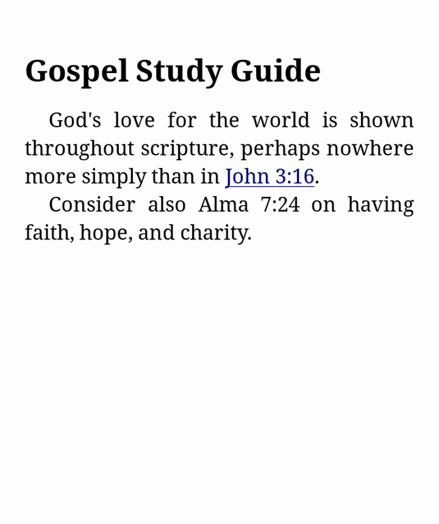

# scripturegoto.koplugin

A KOReader plugin that jumps to or previews scripture references from
links or highlighted text.

## Features

- **Go to scripture** — tap a supported scripture link, or highlight a
  plain-text reference (e.g. "Alma 40:11-14"), then jump straight to the
  matching chapter/verse in a scripture EPUB you configure per volume.
- **Preview scripture** — same triggers, but shows the verse(s) or whole
  chapter(s) in a floating window instead, no EPUB required. Text is
  downloaded on first use from
  [bcbooks/scriptures-json](https://github.com/bcbooks/scriptures-json)
  and cached locally.

Both work for a single verse, a verse range or list ("Alma 40:11-14",
"Isa. 24:21, 22"), a whole chapter, or a chapter range ("Ecclesiastes
3-4").

  
  

  
  

## Supported links

- **ChurchofJesusChrist.org** study links, including verse/chapter ranges
- **Bible Gateway**
- **YouVersion / Bible.com**

Highlighted plain text is also recognized against common book names and
abbreviations (e.g. "Isa.", "D&C", "1 Ne.", "JST M").

## Installation

Copy `scripturegoto.koplugin/` into KOReader's `plugins/` directory.

## Configuration

More tools → **Scripture Goto** lets you set the EPUB used for each
scripture volume (`ot`, `nt`, `bofm`, `dc-testament`, `pgp`).

## Development

See [`test-books/README.md`](test-books/README.md) for the dev
environment, running the plugin locally, and test fixtures.
